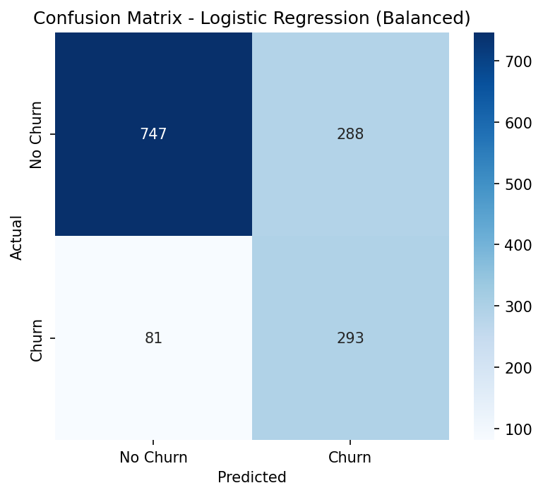
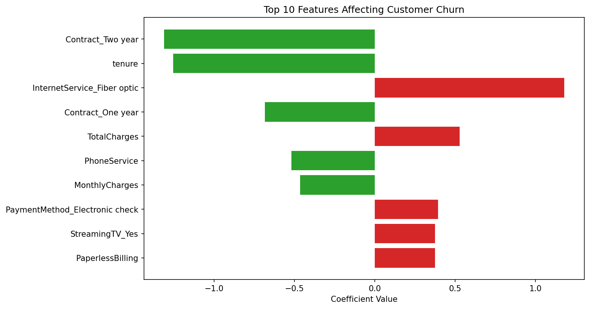

# Customer Churn Prediction — Machine Learning Project

A complete machine learning project that predicts customer churn for a telecom company using real-world data. The project covers the full ML workflow: data cleaning, feature engineering, model training, evaluation, and interpretation — following standard, industry-recognized methodology.

## 📌 Project Overview

Customer churn (customers leaving a service) is a critical business problem, especially in banking and telecom industries. This project builds and compares multiple classification models to predict which customers are likely to churn, based on their account and service usage data.

**Note:** This is a pure Machine Learning modeling project (data → trained model → evaluation), not an ML Engineering project — it does not include deployment, APIs, or production infrastructure.

## 📊 Dataset

- **Source:** [Telco Customer Churn](https://www.kaggle.com/datasets/blastchar/telco-customer-churn) (Kaggle, by BlastChar)
- **Size:** 7,043 customers, 21 original features
- **Target variable:** `Churn` (Yes/No) — imbalanced (73.5% No / 26.5% Yes)

## 🔧 Methodology

1. **Data Cleaning** — Fixed `TotalCharges` (converted to numeric, imputed 11 missing values with 0 for customers with `tenure = 0`)
2. **Feature Engineering** — Label Encoding for binary columns, One-Hot Encoding for multi-category columns (31 final features)
3. **Train/Test Split** — 80/20 split with stratification to preserve class balance
4. **Feature Scaling** — StandardScaler applied to numeric features (resolved a Logistic Regression convergence issue)
5. **Model Training** — Trained and compared 3 models
6. **Model Interpretation** — Analyzed feature coefficients to understand churn drivers

## 🤖 Models & Results

| Model | Accuracy | Precision | Recall | F1-score |
|---|---|---|---|---|
| Logistic Regression (Baseline) | 80.6% | 65.9% | 55.9% | 60.5% |
| Random Forest | 78.4% | 62.2% | 47.9% | 54.1% |
| Logistic Regression (Balanced) | 73.8% | 50.4% | **78.3%** | **61.4%** |

**Key finding:** The simpler baseline model (Logistic Regression) outperformed Random Forest on this dataset — a reminder that model complexity doesn't guarantee better performance. Applying `class_weight='balanced'` significantly improved Recall at the cost of Precision, illustrating a classic precision-recall trade-off relevant to real business decisions (in a retention-focused context, catching more at-risk customers can outweigh a lower overall accuracy).

### Confusion Matrix (Logistic Regression - Balanced)



## 🔍 What Drives Churn? (Feature Importance)



The strongest predictors of churn were:
- **Contract type** — customers on two-year contracts are far less likely to churn than month-to-month customers
- **Tenure** — longer-tenured customers are significantly more loyal
- **Fiber optic internet service** — associated with a higher churn likelihood, possibly due to pricing or service issues

## 🛠️ Tools & Libraries

- Python (Google Colab)
- pandas, numpy — data manipulation
- scikit-learn — modeling & evaluation
- matplotlib, seaborn — visualization

## 📁 Repository Structure

```
├── Customer_Churn_Prediction_Machine_Learning_Project.ipynb   # Full analysis notebook
├── confusion_matrix.png                                        # Model evaluation visual
├── feature_importance.png                                      # Model interpretation visual
└── README.md
```
